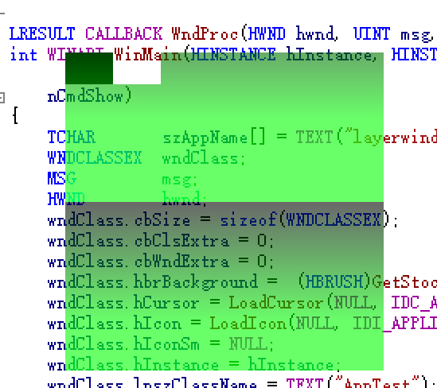

# updatelayeredwindowdemo
demo of UpdateLayeredWindow

## 本demo主要用于展示如何展示使用层次窗口显示一个展开窗口。自己生成位图来展示异形窗口。

## 如何运行
使用你本地visual studio 创建一个空的win32项目，把updatelayeredwindowdemo.cpp添加到源文件，编译运行即可。项目没有其他依赖。

## 项目效果

